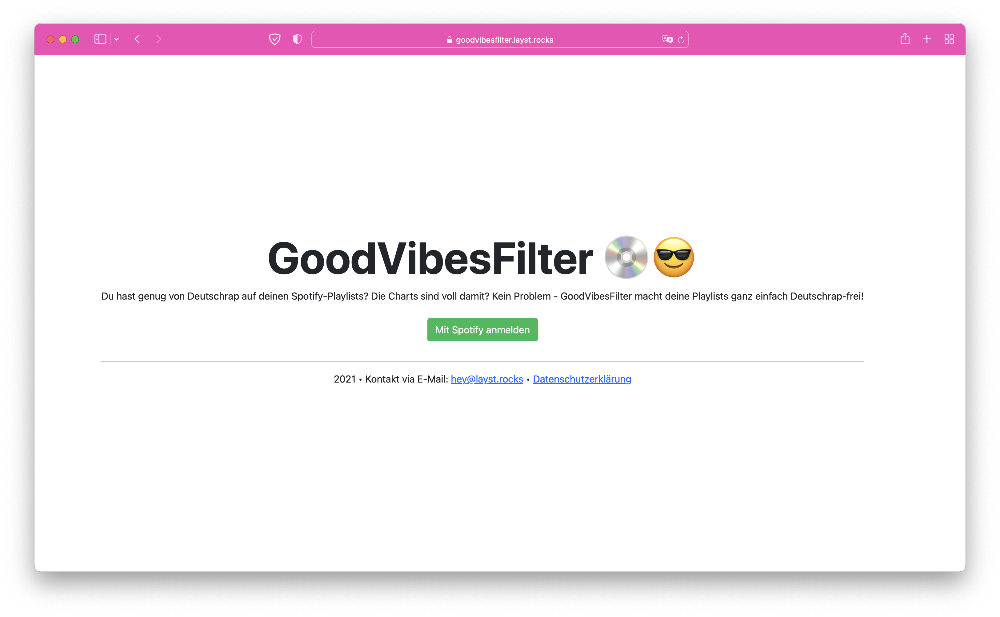
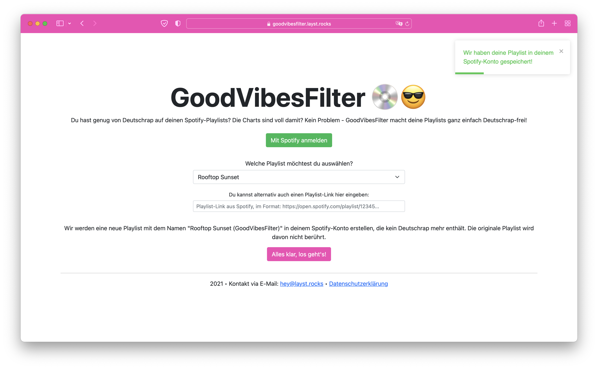

<h1 align="center">GoodVibesFilter</h1>
<p align="center">GoodVibesFilter macht deine Playlists frei von Deutschrap!</p>

<br>

<p align="center">
    <a href="https://github.com/laystrck/GoodVibesFilter/blob/master/package.json">
        
    </a>
    <a href="https://app.netlify.com/sites/peaceful-mestorf-95f4b4/deploys">
        
    </a>
    <a href="https://github.com/laystrck/GoodVibesFilter/blob/master/LICENSE">
        
    </a>
</p>

##

[• Description](#-description)  
[• Usage](#-usage)  
[• Contribution](#-contribution)  
[• License](#%EF%B8%8F-license)

## 📙 Description

GoodVibesFilter macht deine Playlists frei von Deutschrap, höre nur noch gute Musik in deinen Playlists!

Hier sind einige Screenshots der Web-Anwendung:





GoodVibesFilter kann unter [goodvibesfilter.layst.rocks](https://goodvibesfilter.layst.rocks) ausprobiert werden.

## 🖥 Usage

GoodVibesFilter basiert auf React und benötigt kein Server-Backend, sondern kann einfach als statische Web-Anwendung ausgeführt werden. Die Anwendung kommuniziert dabei direkt über den Browser mit der Spotify-API.

### Environment variables

| Env variable                      | Description                                                                                         |
| --------------------------------- | --------------------------------------------------------------------------------------------------- |
| REACT_APP_SPOTIFY_CLIENT_ID       | Client ID der [Spotify-API-Anwendung](https://developer.spotify.com)                                |
| REACT_APP_ENCODED_REDIRECT_URI    | URL, unter der die Web-Anwendung installiert ist, als URL kodiert (z. B. https%3A%2F%2Fexample.com) |
| REACT_APP_CONTACT_EMAIL           | E-Mail-Adresse als Kontakt, die auf der Startseite angezeigt wird                                   |
| REACT_APP_PRIVACY_POLICY_URL      | Link zur Datenschutzerklärung auf der Startseite                                                    |
| REACT_APP_ENABLE_UMAMI_STATISTICS | Statistiken mit Umami erfassen                                                                      |
| REACT_APP_UMAMI_URL               | URL der Umami-Installation                                                                          |
| REACT_APP_UMAMI_ID                | ID der Umami-Installation                                                                           |

### Deployment

First, clone the repository using:

```
$ git clone https://github.com/laystrck/GoodVibesFilter.git
```

Then, install the dependencies using:

```
$ yarn install
```

Finally, run:

```
$ yarn build
```

The built website will be saved in the `build`-folder, just open the `index.html`-file in your browser.

## 🙋‍ Contribution

Contributions are always very welcome! It's completely equal if you're a beginner or a more experienced developer.

Thanks for your interest 🎉👍!

## 👨‍⚖️ License

[MIT](https://github.com/laystrck/GoodVibesFilter/blob/master/LICENSE)
