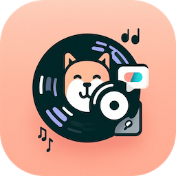
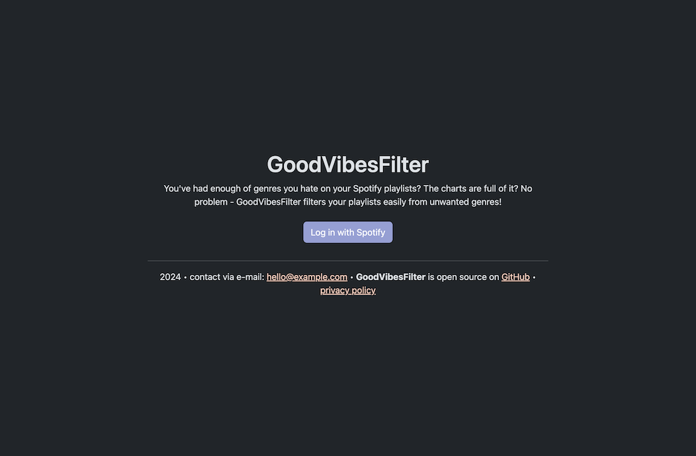
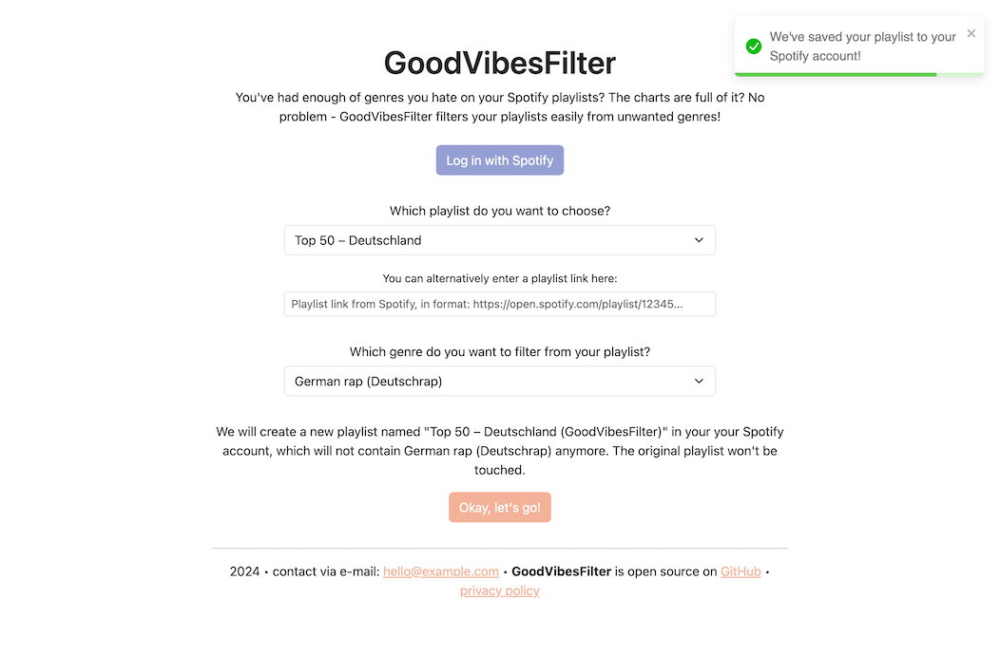

<p align="center">
    
</p>

<h1 align="center">GoodVibesFilter</h1>
<p align="center">GoodVibesFilter filters unwanted genres from your playlists!</p>

<br>

<p align="center">
    <a href="https://github.com/laystrck/GoodVibesFilter/blob/master/package.json">
        
    </a>
    <a href="https://app.netlify.com/sites/peaceful-mestorf-95f4b4/deploys">
        
    </a>
    <a href="https://github.com/laystrck/GoodVibesFilter/blob/master/LICENSE">
        
    </a>
</p>

##

[Description](#-description) | [Usage](#-usage) | [Contribution](#-contribution) | [License](#%EF%B8%8F-license)

## 📙 Description

GoodVibesFilter filters unwanted genres from your playlists, listen to good music only in your playlists!

Here are some screenshots of the web application:





## 🖥 Usage

GoodVibesFilter is based on React and needs no server backend, but can be hosted as a static web page. The application communicates with the Spotify API directly inside the browser.

### Environment variables

| Env variable                      | Description                                                                      |
| --------------------------------- | -------------------------------------------------------------------------------- |
| REACT_APP_SPOTIFY_CLIENT_ID       | Client ID of the [Spotify API app](https://developer.spotify.com)                |
| REACT_APP_ENCODED_REDIRECT_URI    | URL where the web app is hosted, encoded as URL (e.g. https%3A%2F%2Fexample.com) |
| REACT_APP_CONTACT_EMAIL           | Contact e-mail address shown on home page                                        |
| REACT_APP_PRIVACY_POLICY_URL      | Link to privacy policy on home page                                              |
| REACT_APP_ENABLE_UMAMI_STATISTICS | Collect statistics with [Umami](https://github.com/mikecao/umami)                |
| REACT_APP_UMAMI_URL               | URL of the Umami instance                                                        |
| REACT_APP_UMAMI_ID                | ID of the Umami site                                                             |

### Deploy the application locally

Clone the repository and install the dependencies using:

```
$ yarn install
```

Then run this command to build the web app:

```
$ yarn build
```

The built website will be available in the `build`-folder, just open the `index.html`-file in your browser or upload the files to a web server.

## 🙋‍ Contribution

Contributions are always very welcome! It's completely equal if you're a beginner or a more experienced developer.

Thanks for your interest 🎉👍!

## 👨‍⚖️ License

[MIT](https://github.com/laystrck/GoodVibesFilter/blob/master/LICENSE)
